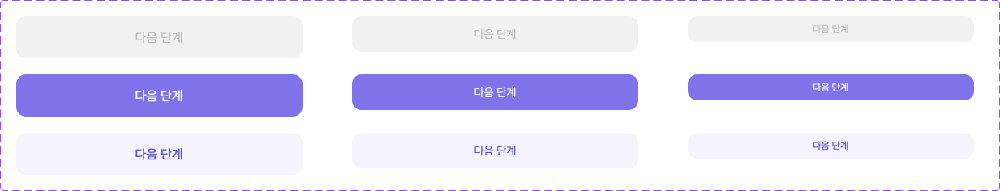

# 🧩 Button 상세 명세서

[🔗 Figma 원본 링크](https://www.figma.com/design/bLZr7Nh53PmRHuEjX7gNco?node-id=381-1834)

## 🏗️ Structure & Layout

- 🟦 **Button** (COMPONENT_SET) `W: 1233.0, H: 236.0` [Radius: 5]
  - 🖼️ **Variant: Disabled, Large** (COMPONENT) `W: 353.0, H: 52.0` [X: 20.0, Y: 20.0 | Fill: gray100 (gray100 (gray100 (#f1f1f1))) (op: 1.00) | Radius: 12]
    - 🖼️ **edit** (INSTANCE) `W: 20.0, H: 20.0` [X: 132.5, Y: 16.0]
    - 📝 **다음 단계** (TEXT) `W: 60.0, H: 24.0` [X: 146.5, Y: 14.0 | Font: dsBody2Medium | Color: gray400 (gray400 (gray400 (#b8b8b8))) (op: 1.00)]
    - 🖼️ **edit** (INSTANCE) `W: 20.0, H: 20.0` [X: 214.5, Y: 16.0]
  - 🖼️ **Variant: Disabled, Medium** (COMPONENT) `W: 353.0, H: 44.0` [X: 434.0, Y: 20.0 | Fill: gray100 (gray100 (gray100 (#f1f1f1))) (op: 1.00) | Radius: 12]
    - 🖼️ **edit** (INSTANCE) `W: 16.0, H: 16.0` [X: 138.5, Y: 14.0]
    - 📝 **다음 단계** (TEXT) `W: 52.0, H: 20.0` [X: 150.5, Y: 12.0 | Font: dsBody3Medium | Color: gray400 (gray400 (gray400 (#b8b8b8))) (op: 1.00)]
    - 🖼️ **edit** (INSTANCE) `W: 16.0, H: 16.0` [X: 210.5, Y: 14.0]
  - 🖼️ **Variant: Disabled, Small** (COMPONENT) `W: 353.0, H: 32.0` [X: 848.0, Y: 20.0 | Fill: gray100 (gray100 (gray100 (#f1f1f1))) (op: 1.00) | Radius: 12]
    - 🖼️ **edit** (INSTANCE) `W: 14.0, H: 14.0` [X: 145.0, Y: 9.0]
    - 📝 **다음 단계** (TEXT) `W: 45.0, H: 16.0` [X: 154.0, Y: 8.0 | Font: dsCaption1Medium | Color: gray400 (gray400 (gray400 (#b8b8b8))) (op: 1.00)]
    - 🖼️ **edit** (INSTANCE) `W: 14.0, H: 14.0` [X: 203.0, Y: 9.0]
  - 🖼️ **Variant: Primary, Large** (COMPONENT) `W: 353.0, H: 52.0` [X: 20.0, Y: 92.0 | Fill: primary600 (primary600 (primary600 (#7f73ea))) (op: 1.00) | Radius: 12]
    - 🖼️ **edit** (INSTANCE) `W: 20.0, H: 20.0` [X: 132.5, Y: 16.0]
    - 📝 **다음 단계** (TEXT) `W: 60.0, H: 24.0` [X: 146.5, Y: 14.0 | Font: dsBody2SemiBold | Color: whiteOpacity60 (whiteOpacity60 (whiteOpacity60 (#ffffff))) (op: 1.00)]
    - 🖼️ **edit** (INSTANCE) `W: 20.0, H: 20.0` [X: 214.5, Y: 16.0]
  - 🖼️ **Variant: Secondary, Large** (COMPONENT) `W: 353.0, H: 52.0` [X: 20.0, Y: 164.0 | Fill: primary50 (primary50 (primary50 (#f5f3fe))) (op: 1.00) | Radius: 12]
    - 🖼️ **edit** (INSTANCE) `W: 20.0, H: 20.0` [X: 132.5, Y: 16.0]
    - 📝 **다음 단계** (TEXT) `W: 60.0, H: 24.0` [X: 146.5, Y: 14.0 | Font: dsBody2SemiBold | Color: primary700 (primary700 (primary700 (#5757d7))) (op: 1.00)]
    - 🖼️ **edit** (INSTANCE) `W: 20.0, H: 20.0` [X: 214.5, Y: 16.0]
  - 🖼️ **Variant: Primary, Medium** (COMPONENT) `W: 353.0, H: 44.0` [X: 434.0, Y: 92.0 | Fill: primary600 (primary600 (primary600 (#7f73ea))) (op: 1.00) | Radius: 12]
    - 🖼️ **edit** (INSTANCE) `W: 16.0, H: 16.0` [X: 138.5, Y: 14.0]
    - 📝 **다음 단계** (TEXT) `W: 52.0, H: 20.0` [X: 150.5, Y: 12.0 | Font: dsBody3Medium | Color: whiteOpacity60 (whiteOpacity60 (whiteOpacity60 (#ffffff))) (op: 1.00)]
    - 🖼️ **edit** (INSTANCE) `W: 16.0, H: 16.0` [X: 210.5, Y: 14.0]
  - 🖼️ **Variant: Secondary, Medium** (COMPONENT) `W: 353.0, H: 44.0` [X: 434.0, Y: 164.0 | Fill: primary50 (primary50 (primary50 (#f5f3fe))) (op: 1.00) | Radius: 12]
    - 🖼️ **edit** (INSTANCE) `W: 16.0, H: 16.0` [X: 138.5, Y: 14.0]
    - 📝 **다음 단계** (TEXT) `W: 52.0, H: 20.0` [X: 150.5, Y: 12.0 | Font: dsBody3Medium | Color: primary700 (primary700 (primary700 (#5757d7))) (op: 1.00)]
    - 🖼️ **edit** (INSTANCE) `W: 16.0, H: 16.0` [X: 210.5, Y: 14.0]
  - 🖼️ **Variant: Primary, Small** (COMPONENT) `W: 353.0, H: 32.0` [X: 848.0, Y: 92.0 | Fill: primary600 (primary600 (primary600 (#7f73ea))) (op: 1.00) | Radius: 12]
    - 🖼️ **edit** (INSTANCE) `W: 14.0, H: 14.0` [X: 145.0, Y: 9.0]
    - 📝 **다음 단계** (TEXT) `W: 45.0, H: 16.0` [X: 154.0, Y: 8.0 | Font: dsCaption1SemiBold | Color: whiteOpacity60 (whiteOpacity60 (whiteOpacity60 (#ffffff))) (op: 1.00)]
    - 🖼️ **edit** (INSTANCE) `W: 14.0, H: 14.0` [X: 203.0, Y: 9.0]
  - 🖼️ **Variant: Secondary, Small** (COMPONENT) `W: 353.0, H: 32.0` [X: 848.0, Y: 164.0 | Fill: primary50 (primary50 (primary50 (#f5f3fe))) (op: 1.00) | Radius: 12]
    - 🖼️ **edit** (INSTANCE) `W: 14.0, H: 14.0` [X: 145.0, Y: 9.0]
    - 📝 **다음 단계** (TEXT) `W: 45.0, H: 16.0` [X: 154.0, Y: 8.0 | Font: dsCaption1SemiBold | Color: primary700 (primary700 (primary700 (#5757d7))) (op: 1.00)]
    - 🖼️ **edit** (INSTANCE) `W: 14.0, H: 14.0` [X: 203.0, Y: 9.0]
