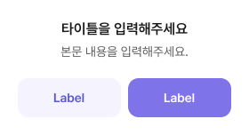

# 🧩 Dialog_Type2 상세 명세서

[🔗 Figma 원본 링크](https://www.figma.com/design/bLZr7Nh53PmRHuEjX7gNco?node-id=394-5230)

> [!IMPORTANT]
> 다이얼로그(Dialog) 컴포넌트의 가로 폭(Width)은 **280px로 항상 고정**됩니다.

## 🏗️ Structure & Layout

- 🖼️ **Dialog** (INSTANCE) `W: 280.0, H: 152.0` [Fill: whiteOpacity60 (#ffffff) (op: 1.00) | Radius: 12]
  - 🟦 **Frame 625626** (FRAME) `W: 280.0, H: 68.0` [X: 0.0, Y: 0.0]
    - 🟦 **text** (FRAME) `W: 280.0, H: 68.0` [X: 0.0, Y: 0.0]
      - 🟦 **Frame 625625** (FRAME) `W: 240.0, H: 48.0` [X: 20.0, Y: 20.0]
        - 📝 **타이틀을 입력해주세요** (TEXT) `W: 240.0, H: 24.0` [X: 0.0, Y: 0.0 | Font: dsBody2SemiBold (Figma LH: 24.0px) | Color: gray975 (#171717) (op: 1.00)]
        - 📝 **본문 내용을 입력해주세요.** (TEXT) `W: 240.0, H: 20.0` [X: 0.0, Y: 28.0 | Font: dsBody3Regular (Figma LH: 20.0px) | Color: gray800 (#5c5c5c) (op: 1.00)]
  - 🖼️ **Button** (INSTANCE) `W: 280.0, H: 84.0` [X: 0.0, Y: 68.0]
    - 🟦 **Frame 1430106107** (FRAME) `W: 240.0, H: 44.0` [X: 20.0, Y: 20.0]
      - 🖼️ **Button** (INSTANCE) `W: 116.0, H: 44.0` [X: 0.0, Y: 0.0]
        - 🖼️ **Button** (INSTANCE) `W: 116.0, H: 44.0` [X: 0.0, Y: 0.0 | Fill: primary50 (#f5f3fe) (op: 1.00) | Radius: 12]
          - 📝 **다음 단계** (TEXT) `W: 36.0, H: 20.0` [X: 40.0, Y: 12.0 | Font: dsBody3SemiBold (Figma LH: 20.0px) | Color: primary700 (#5757d7) (op: 1.00)]
      - 🖼️ **Button** (INSTANCE) `W: 116.0, H: 44.0` [X: 124.0, Y: 0.0]
        - 🖼️ **Button** (INSTANCE) `W: 116.0, H: 44.0` [X: 0.0, Y: 0.0 | Fill: primary600 (#7f73ea) (op: 1.00) | Radius: 12]
          - 📝 **다음 단계** (TEXT) `W: 36.0, H: 20.0` [X: 40.0, Y: 12.0 | Font: dsBody3SemiBold (Figma LH: 20.0px) | Color: whiteOpacity60 (#ffffff) (op: 1.00)]
