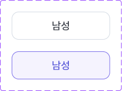

# 🧩 SelectBox 상세 명세서

[🔗 Figma 원본 링크](https://www.figma.com/design/bLZr7Nh53PmRHuEjX7gNco?node-id=1075-13113)

## 🏗️ Structure & Layout

- 🟦 **SelectBox** (COMPONENT_SET) `W: 208.5, H: 156.0` [Radius: 5]
  - 🖼️ **Variant: off** (COMPONENT) `W: 168.5, H: 48.0` [X: 20.0, Y: 20.0 | Fill: white (#ffffff) (op: 1.00) | Stroke: coolGray300 (#d6dce5) (op: 1.00) | Radius: 12]
    - 📝 **남성** (TEXT) `W: 136.5, H: 21.0` [X: 16.0, Y: 13.5 | Font: dsBody1Medium | Color: coolGray800 (#373c46) (op: 1.00)]
  - 🖼️ **Variant: on** (COMPONENT) `W: 168.5, H: 48.0` [X: 20.0, Y: 88.0 | Fill: primary50 (#f5f3fe) (op: 1.00) | Stroke: primary600 (#7f73ea) (op: 1.00) | Radius: 12]
    - 📝 **남성** (TEXT) `W: 136.5, H: 21.0` [X: 16.0, Y: 13.5 | Font: dsBody1Medium | Color: primary700 (#5757d7) (op: 1.00)]

## 구현 계약

- 선택 상태는 화면이 소유하며 `Binding<Bool>`로 입력합니다.
- 컴포넌트 높이는 48pt로 고정합니다.
- 텍스트는 `Body1/Medium (18/26)`을 사용하며 48pt 컨테이너 안에서 수직 중앙 정렬합니다.
- 좌우 콘텐츠 인셋은 16pt이며, 상하 padding보다 48pt 고정 높이를 우선합니다.
- 고정 너비를 갖지 않으며 부모가 제안한 너비를 채웁니다. 사용처는 `frame(width:)` 등으로 너비를 결정합니다.
- Figma에 정의되지 않은 pressed·disabled 상태는 추가하지 않습니다.
