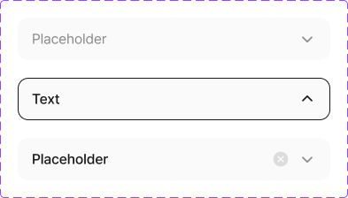

# 🧩 SelectField 상세 명세서

[🔗 Figma 원본 링크](https://www.figma.com/design/bLZr7Nh53PmRHuEjX7gNco?node-id=1086-16782)

## 🏗️ Structure & Layout

- 🟦 **SelectField** (COMPONENT_SET) `W: 393.0, H: 224.0` [Radius: 5]
  - 🖼️ **Variant: Default** (COMPONENT) `W: 353.0, H: 48.0` [X: 20.0, Y: 20.0 | Fill: gray25 (#fafafa) (op: 1.00) | Radius: 12]
    - 📝 **Placeholder** (TEXT) `W: 291.0, H: 21.0` [X: 16.0, Y: 13.5 | Font: dsBody2Regular | Color: gray600 (#8a8a8a) (op: 1.00)]
    - 🟦 **chevron_small_bottom** (FRAME) `W: 20.0, H: 20.0` [X: 317.0, Y: 14.0]
      - 🟦 **chevron_small_bottom** (GROUP) `W: 20.0, H: 20.0` [X: 0.0, Y: 0.0]
        - 🟦 **content_area** (RECTANGLE) `W: 20.0, H: 20.0` [X: 0.0, Y: 0.0]
        - 🟦 **content** (GROUP) `W: 16.7, H: 16.7` [X: 1.7, Y: 1.7]
          - 🟦 **background** (RECTANGLE) `W: 16.7, H: 16.7` [X: 0.0, Y: 0.0]
  - 🖼️ **Variant: success** (COMPONENT) `W: 353.0, H: 48.0` [X: 20.0, Y: 156.0 | Fill: gray25 (#fafafa) (op: 1.00) | Radius: 12]
    - 📝 **Placeholder** (TEXT) `W: 261.0, H: 21.0` [X: 16.0, Y: 13.5 | Font: dsBody2Medium | Color: gray975 (#171717) (op: 1.00)]
    - 🖼️ **circle_x_fill** (INSTANCE) `W: 20.0, H: 20.0` [X: 287.0, Y: 14.0]
      - 🟦 **circle_x_fill** (GROUP) `W: 20.0, H: 20.0` [X: 0.0, Y: 0.0]
        - 🟦 **content_area** (RECTANGLE) `W: 20.0, H: 20.0` [X: 0.0, Y: 0.0]
        - 🟦 **content** (GROUP) `W: 20.0, H: 20.0` [X: 0.0, Y: 0.0]
          - 🟦 **Background** (RECTANGLE) `W: 20.0, H: 20.0` [X: 0.0, Y: 0.0]
    - 🟦 **chevron_small_bottom** (FRAME) `W: 20.0, H: 20.0` [X: 317.0, Y: 14.0]
      - 🟦 **chevron_small_bottom** (GROUP) `W: 20.0, H: 20.0` [X: 0.0, Y: 0.0]
        - 🟦 **content_area** (RECTANGLE) `W: 20.0, H: 20.0` [X: 0.0, Y: 0.0]
        - 🟦 **content** (GROUP) `W: 16.7, H: 16.7` [X: 1.7, Y: 1.7]
          - 🟦 **background** (RECTANGLE) `W: 16.7, H: 16.7` [X: 0.0, Y: 0.0]
  - 🖼️ **Variant: focus** (COMPONENT) `W: 353.0, H: 48.0` [X: 20.0, Y: 88.0 | Fill: gray25 (#fafafa) (op: 1.00) | Stroke: gray975 (#171717) (op: 1.00) | Radius: 12]
    - 📝 **Text** (TEXT) `W: 291.0, H: 21.0` [X: 16.0, Y: 13.5 | Font: dsBody2Medium | Color: gray975 (#171717) (op: 1.00)]
    - 🟦 **chevron_small_bottom** (FRAME) `W: 20.0, H: 20.0` [X: 317.0, Y: 14.0]
      - 🟦 **chevron_small_bottom** (GROUP) `W: 20.0, H: 20.0` [X: 0.0, Y: 0.0]
        - 🟦 **content_area** (RECTANGLE) `W: 20.0, H: 20.0` [X: 0.0, Y: 0.0]
        - 🟦 **content** (GROUP) `W: 16.7, H: 16.7` [X: 1.7, Y: 1.7]
          - 🟦 **background** (RECTANGLE) `W: 16.7, H: 16.7` [X: 0.0, Y: 0.0]
