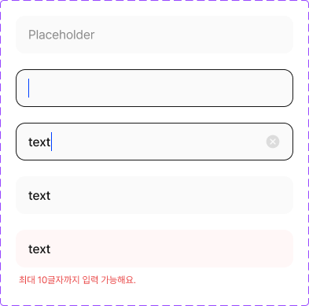

# 🧩 TextField 상세 명세서

[🔗 Figma 원본 링크](https://www.figma.com/design/bLZr7Nh53PmRHuEjX7gNco?node-id=1086-12434)

## 🏗️ Structure & Layout

- 🟦 **TextField** (COMPONENT_SET) `W: 393.0, H: 389.0` [Radius: 5]
  - 🖼️ **Variant: Default** (COMPONENT) `W: 353.0, H: 48.0` [X: 20.0, Y: 20.0 | Fill: gray25 (gray25 (gray25 (#fafafa))) (op: 1.00) | Radius: 12]
    - 📝 **Placeholder** (TEXT) `W: 321.0, H: 21.0` [X: 16.0, Y: 13.5 | Font: dsBody2Regular | Color: gray600 (gray600 (gray600 (#8a8a8a))) (op: 1.00)]
  - 🖼️ **Variant: focus** (COMPONENT) `W: 353.0, H: 48.0` [X: 20.0, Y: 88.0 | Fill: gray25 (gray25 (gray25 (#fafafa))) (op: 1.00) | Stroke: gray975 (gray975 (gray975 (#171717))) (op: 1.00) | Radius: 12]
    - 🟦 **Rectangle 34626000** (RECTANGLE) `W: 1.0, H: 24.0` [X: 16.0, Y: 12.0 | Fill: #0040ff (op: 1.00)]
    - 📝 **예) 토닥운** (TEXT) `W: 320.0, H: 21.0` [X: 17.0, Y: 13.5 | Font: dsBody2Regular | Color: gray600 (gray600 (gray600 (#8a8a8a))) (op: 1.00)]
  - 🖼️ **Variant: insert** (COMPONENT) `W: 353.0, H: 48.0` [X: 20.0, Y: 156.0 | Fill: gray25 (gray25 (gray25 (#fafafa))) (op: 1.00) | Stroke: gray975 (gray975 (gray975 (#171717))) (op: 1.00) | Radius: 12]
    - 🟦 **Frame 1430106244** (FRAME) `W: 30.0, H: 24.0` [X: 16.0, Y: 12.0]
      - 📝 **text** (TEXT) `W: 29.0, H: 24.0` [X: 0.0, Y: 0.0 | Font: dsBody2Medium | Color: gray975 (gray975 (gray975 (#171717))) (op: 1.00)]
      - 🟦 **Rectangle 34626000** (RECTANGLE) `W: 1.0, H: 24.0` [X: 29.0, Y: 0.0 | Fill: #0040ff (op: 1.00)]
    - 🖼️ **circle_x_fill** (INSTANCE) `W: 20.0, H: 20.0` [X: 317.0, Y: 14.0]
      - 🟦 **circle_x_fill** (GROUP) `W: 20.0, H: 20.0` [X: 0.0, Y: 0.0]
        - 🟦 **content_area** (RECTANGLE) `W: 20.0, H: 20.0` [X: 0.0, Y: 0.0]
        - 🟦 **content** (GROUP) `W: 20.0, H: 20.0` [X: 0.0, Y: 0.0]
          - 🟦 **Background** (RECTANGLE) `W: 20.0, H: 20.0` [X: 0.0, Y: 0.0]
  - 🖼️ **Variant: success** (COMPONENT) `W: 353.0, H: 48.0` [X: 20.0, Y: 224.0 | Fill: gray25 (gray25 (gray25 (#fafafa))) (op: 1.00) | Radius: 12]
    - 📝 **text** (TEXT) `W: 321.0, H: 24.0` [X: 16.0, Y: 12.0 | Font: dsBody2Medium | Color: gray975 (gray975 (gray975 (#171717))) (op: 1.00)]
  - 🖼️ **Variant: error** (COMPONENT) `W: 353.0, H: 72.0` [X: 20.0, Y: 292.0 | Radius: 12]
    - 🟦 **Frame 1430106418** (FRAME) `W: 353.0, H: 72.0` [X: 0.0, Y: 0.0]
      - 🟦 **Frame 1430106417** (FRAME) `W: 353.0, H: 48.0` [X: 0.0, Y: 0.0 | Fill: red50 (red50 (red50 (#fff7f7))) (op: 1.00) | Radius: 12]
        - 📝 **text** (TEXT) `W: 321.0, H: 24.0` [X: 16.0, Y: 12.0 | Font: dsBody2Medium | Color: gray975 (gray975 (gray975 (#171717))) (op: 1.00)]
      - 🟦 **Frame 1430106416** (FRAME) `W: 353.0, H: 16.0` [X: 0.0, Y: 56.0]
        - 📝 **최대 10글자까지 입력 가능해요.** (TEXT) `W: 149.0, H: 16.0` [X: 4.0, Y: 0.0 | Font: dsCaption1Regular | Color: red500 (red500 (red500 (#ea4343))) (op: 1.00)]
