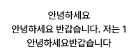

# 🧩 Tooltip_white 상세 명세서

[🔗 Figma 원본 링크](https://www.figma.com/design/bLZr7Nh53PmRHuEjX7gNco/Yapp-2%EC%A1%B0--%ED%86%A0%EB%8B%A5%EC%9A%B4-?node-id=3179-37583&t=Y0VDu0wefCwPEnTJ-4)

## 🏗️ Structure & Layout

- 🖼️ **Tooltip_white** (COMPONENT) `W: 198.0, H: 78.0`
  - 🔺 **Polygon 4** (REGULAR_POLYGON) `W: 8.0, H: 8.0` [X: 95.0, Y: 0.0 | Fill: white (#ffffff) (op: 0.90)]
  - 🟦 **Frame 1430106301** (FRAME) `W: 198.0, H: 72.0` [X: 0.0, Y: 6.0 | Fill: white (#ffffff) (op: 0.90) | Radius: 12]
    - 📝 **메시지** (TEXT) `W: 166.0, H: 60.0` [X: 16.0, Y: 6.0 | Font: Pretendard Medium (14/20) | Color: black (#000000) | Align: center]

## 구현 계약

- `DSTooltip(_:variant: .white)`로 렌더링한다.
- 말풍선의 내부 여백은 좌우 16pt, 상하 6pt이며 모서리 반경은 12pt다.
- 말풍선의 최대 너비는 200pt이며, 초과하는 메시지는 해당 너비 안에서 줄바꿈한다.
- 텍스트는 `Body3/Medium (14/20)`을 사용하고 줄 수 제한 없이 가운데 정렬한다.
- 화살표는 Figma의 8pt 프레임 안에서 위쪽에 배치하고, 말풍선과 2pt 겹친다.
- 말풍선과 화살표는 `whiteOpacity90` 컬러 에셋을 사용하고, 텍스트는 `black` 컬러 에셋을 사용한다.
