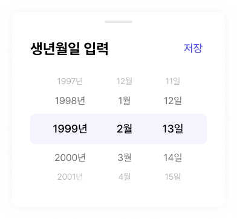

# 🧩 WheelPicker_multi02 상세 명세서

[🔗 Figma 원본 링크](https://www.figma.com/design/bLZr7Nh53PmRHuEjX7gNco?node-id=383-1347)

## 🏗️ Structure & Layout

- 🖼️ **WheelPicker_multi02** (COMPONENT) `W: 352.0, H: 322.0` [Fill: white (#ffffff) (op: 1.00) | Radius: 12]
  - 🟦 **Frame 1430106076** (FRAME) `W: 292.0, H: 238.0` [X: 30.0, Y: 44.0]
    - 🟦 **Frame 1430106131** (FRAME) `W: 292.0, H: 32.0` [X: 0.0, Y: 0.0]
      - 📝 **생년월일 입력** (TEXT) `W: 220.0, H: 32.0` [X: 0.0, Y: 0.0 | Font: dsHeading3Bold | Color: black (#000000) (op: 1.00)]
      - 🟦 **Frame 1430106132** (FRAME) `W: 44.0, H: 31.0` [X: 248.0, Y: 0.5 | Radius: 100]
        - 📝 **저장** (TEXT) `W: 32.0, H: 26.0` [X: 6.0, Y: 2.5 | Font: dsBody1Medium | Color: primary700 (#5757d7) (op: 1.00)]
    - 🟦 **Frame 1430106075** (FRAME) `W: 292.0, H: 178.0` [X: 0.0, Y: 60.0]
      - 🟦 **Frame 1430106071** (FRAME) `W: 220.0, H: 20.0` [X: 36.0, Y: 0.0]
        - 📝 **1997년** (TEXT) `W: 60.0, H: 20.0` [X: 0.0, Y: 0.0 | Font: dsBody3Regular | Color: gray400 (#b8b8b8) (op: 1.00)]
        - 📝 **12월** (TEXT) `W: 40.0, H: 20.0` [X: 100.0, Y: 0.0 | Font: dsBody3Regular | Color: gray400 (#b8b8b8) (op: 1.00)]
        - 📝 **11일** (TEXT) `W: 40.0, H: 20.0` [X: 180.0, Y: 0.0 | Font: dsBody3Regular | Color: gray400 (#b8b8b8) (op: 1.00)]
      - 🟦 **Frame 1430106070** (FRAME) `W: 220.0, H: 24.0` [X: 36.0, Y: 30.0]
        - 📝 **1998년** (TEXT) `W: 60.0, H: 24.0` [X: 0.0, Y: 0.0 | Font: dsBody2Regular | Color: gray700 (#737373) (op: 1.00)]
        - 📝 **1월** (TEXT) `W: 40.0, H: 24.0` [X: 100.0, Y: 0.0 | Font: dsBody2Regular | Color: gray700 (#737373) (op: 1.00)]
        - 📝 **12일** (TEXT) `W: 40.0, H: 24.0` [X: 180.0, Y: 0.0 | Font: dsBody2Regular | Color: gray700 (#737373) (op: 1.00)]
      - 🟦 **Frame 1430106074** (FRAME) `W: 292.0, H: 50.0` [X: 0.0, Y: 64.0 | Fill: primary50 (#f5f3fe) (op: 1.00) | Radius: 8]
        - 🟦 **Frame 1430106069** (FRAME) `W: 220.0, H: 26.0` [X: 36.0, Y: 12.0]
          - 📝 **1999년** (TEXT) `W: 60.0, H: 26.0` [X: 0.0, Y: 0.0 | Font: dsBody1Medium | Color: black (#000000) (op: 1.00)]
          - 📝 **2월** (TEXT) `W: 40.0, H: 26.0` [X: 100.0, Y: 0.0 | Font: dsBody1Medium | Color: black (#000000) (op: 1.00)]
          - 📝 **13일** (TEXT) `W: 40.0, H: 26.0` [X: 180.0, Y: 0.0 | Font: dsBody1Medium | Color: black (#000000) (op: 1.00)]
      - 🟦 **Frame 1430106072** (FRAME) `W: 220.0, H: 24.0` [X: 36.0, Y: 124.0]
        - 📝 **2000년** (TEXT) `W: 60.0, H: 24.0` [X: 0.0, Y: 0.0 | Font: dsBody2Regular | Color: gray700 (#737373) (op: 1.00)]
        - 📝 **3월** (TEXT) `W: 40.0, H: 24.0` [X: 100.0, Y: 0.0 | Font: dsBody2Regular | Color: gray700 (#737373) (op: 1.00)]
        - 📝 **14일** (TEXT) `W: 40.0, H: 24.0` [X: 180.0, Y: 0.0 | Font: dsBody2Regular | Color: gray700 (#737373) (op: 1.00)]
      - 🟦 **Frame 1430106073** (FRAME) `W: 220.0, H: 20.0` [X: 36.0, Y: 158.0]
        - 📝 **2001년** (TEXT) `W: 60.0, H: 20.0` [X: 0.0, Y: 0.0 | Font: dsBody3Regular | Color: gray400 (#b8b8b8) (op: 1.00)]
        - 📝 **4월** (TEXT) `W: 40.0, H: 20.0` [X: 100.0, Y: 0.0 | Font: dsBody3Regular | Color: gray400 (#b8b8b8) (op: 1.00)]
        - 📝 **15일** (TEXT) `W: 40.0, H: 20.0` [X: 180.0, Y: 0.0 | Font: dsBody3Regular | Color: gray400 (#b8b8b8) (op: 1.00)]
