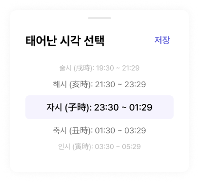

# 🧩 WheelPicker_single 상세 명세서

[🔗 Figma 원본 링크](https://www.figma.com/design/bLZr7Nh53PmRHuEjX7gNco?node-id=383-1630)

## 🏗️ Structure & Layout

- 🖼️ **WheelPicker_single** (COMPONENT) `W: 352.0, H: 319.0` [Fill: white (#ffffff) (op: 1.00) | Radius: 12]
  - 🟦 **Frame 1430106076** (FRAME) `W: 292.0, H: 235.0` [X: 30.0, Y: 44.0]
    - 🟦 **Frame 1430106133** (FRAME) `W: 292.0, H: 32.0` [X: 0.0, Y: 0.0]
      - 📝 **태어난 시각 선택** (TEXT) `W: 220.0, H: 32.0` [X: 0.0, Y: 0.0 | Font: dsHeading3Bold | Color: black (#000000) (op: 1.00)]
      - 🟦 **Frame 1430106132** (FRAME) `W: 44.0, H: 31.0` [X: 248.0, Y: 0.0 | Radius: 100]
        - 📝 **저장** (TEXT) `W: 32.0, H: 26.0` [X: 6.0, Y: 2.5 | Font: dsBody1Medium | Color: primary700 (#5757d7) (op: 1.00)]
    - 🟦 **Frame 1430106075** (FRAME) `W: 292.0, H: 175.0` [X: 0.0, Y: 60.0]
      - 📝 **술시 (戌時): 19:30 ~ 21:29** (TEXT) `W: 159.0, H: 20.0` [X: 66.5, Y: 0.0 | Font: dsBody3Regular | Color: gray400 (#b8b8b8) (op: 1.00)]
      - 📝 **해시 (亥時): 21:30 ~ 23:29** (TEXT) `W: 184.0, H: 24.0` [X: 54.0, Y: 30.0 | Font: dsBody2Regular | Color: gray700 (#737373) (op: 1.00)]
      - 🟦 **Frame 1430106074** (FRAME) `W: 292.0, H: 47.0` [X: 0.0, Y: 64.0 | Fill: primary50 (#f5f3fe) (op: 1.00) | Radius: 8]
        - 📝 **자시 (子時): 23:30 ~ 01:29** (TEXT) `W: 220.0, H: 23.0` [X: 36.0, Y: 12.0 | Font: dsBody1Medium (Figma LH: 23.4px) | Color: black (#000000) (op: 1.00)]
      - 📝 **축시 (丑時): 01:30 ~ 03:29** (TEXT) `W: 184.0, H: 24.0` [X: 54.0, Y: 121.0 | Font: dsBody2Regular | Color: gray700 (#737373) (op: 1.00)]
      - 📝 **인시 (寅時): 03:30 ~ 05:29** (TEXT) `W: 163.0, H: 20.0` [X: 64.5, Y: 155.0 | Font: dsBody3Regular | Color: gray400 (#b8b8b8) (op: 1.00)]
