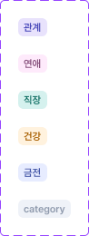

# 🧩 badge 상세 명세서

[🔗 Figma 원본 링크](https://www.figma.com/design/bLZr7Nh53PmRHuEjX7gNco?node-id=390-1612)

## 🏗️ Structure & Layout

- 🟦 **badge** (COMPONENT_SET) `W: 98.0, H: 260.0` [Radius: 5]
  - 🖼️ **Variant: yellow** (COMPONENT) `W: 32.0, H: 20.0` [X: 20.0, Y: 140.0 | Fill: orange100 (#fff2de) (op: 1.00) | Radius: 6]
    - 📝 **건강** (TEXT) `W: 20.0, H: 14.0` [X: 6.0, Y: 3.0 | Font: dsCaption2SemiBold | Color: orange800 (#a85f00) (op: 1.00)]
  - 🖼️ **Variant: green** (COMPONENT) `W: 32.0, H: 20.0` [X: 20.0, Y: 100.0 | Fill: teal100 (#d5f1ee) (op: 1.00) | Radius: 6]
    - 📝 **직장** (TEXT) `W: 20.0, H: 14.0` [X: 6.0, Y: 3.0 | Font: dsCaption2SemiBold | Color: teal800 (#127065) (op: 1.00)]
  - 🖼️ **Variant: pink** (COMPONENT) `W: 32.0, H: 20.0` [X: 20.0, Y: 60.0 | Fill: pink100 (#feeafb) (op: 1.00) | Radius: 6]
    - 📝 **연애** (TEXT) `W: 20.0, H: 14.0` [X: 6.0, Y: 3.0 | Font: dsCaption2SemiBold | Color: pink800 (#87507c) (op: 1.00)]
  - 🖼️ **Variant: purple** (COMPONENT) `W: 32.0, H: 20.0` [X: 20.0, Y: 20.0 | Fill: primary100 (#e8e2fc) (op: 1.00) | Radius: 6]
    - 📝 **관계** (TEXT) `W: 20.0, H: 14.0` [X: 6.0, Y: 3.0 | Font: dsCaption2SemiBold | Color: primary800 (#4545b8) (op: 1.00)]
  - 🖼️ **Variant: blue** (COMPONENT) `W: 32.0, H: 20.0` [X: 20.0, Y: 180.0 | Fill: sky100 (#e7ecff) (op: 1.00) | Radius: 6]
    - 📝 **금전** (TEXT) `W: 20.0, H: 14.0` [X: 6.0, Y: 3.0 | Font: dsCaption2SemiBold | Color: sky800 (#4658a8) (op: 1.00)]
  - 🖼️ **Variant: gray** (COMPONENT) `W: 58.0, H: 20.0` [X: 20.0, Y: 220.0 | Fill: coolGray100 (#eff2f8) (op: 1.00) | Radius: 6]
    - 📝 **category** (TEXT) `W: 46.0, H: 14.0` [X: 6.0, Y: 3.0 | Font: dsCaption2SemiBold | Color: coolGray500 (#8f9aad) (op: 1.00)]
