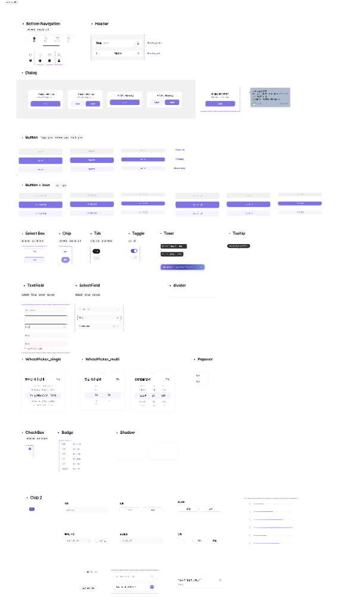
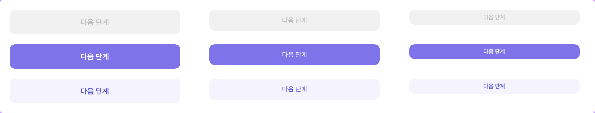
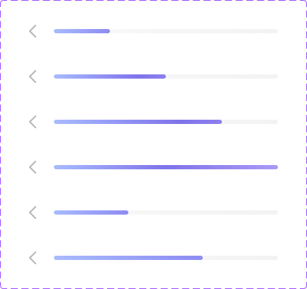
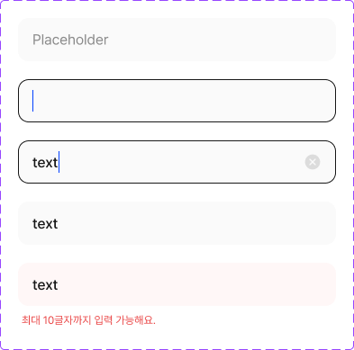
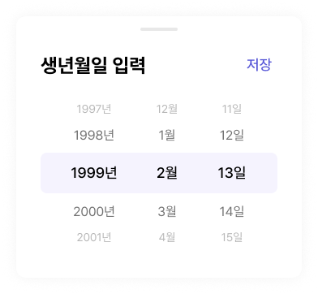
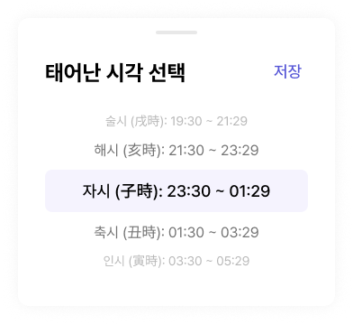
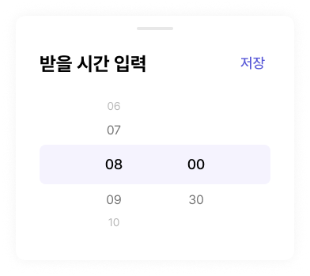
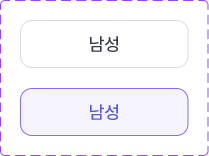
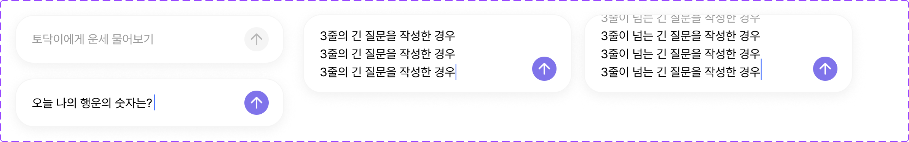
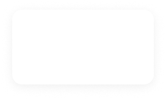

# 🎨 Figma Design Specification (SSOT)

이 문서는 Figma API를 통해 추출된 디자인 시스템 컴포넌트 명세입니다.
에이전트는 디자인 시스템 컴포넌트(`Projects/Core/DesignSystem`) 구현 시 이 문서를 SSOT(Single Source of Truth)로 참조하십시오.

## Runtime Interaction Override

- 디자이너가 별도로 정의한 공통 pressed 정책: pressed 상태를 제공하는 모든 DesignSystem 커스텀 인터랙티브 컨트롤은 누르는 동안 기존 시각 영역 위에 `gray975` 색상을 `16%` opacity로 덮는다.
- 오버레이는 각 컴포넌트의 기존 시각 영역에만 적용한다. 이 정책만으로 최소 크기나 터치 영역을 일괄 변경하지 않는다.
- 아이콘 전용 컨트롤은 별도 배경 사각형이 아니라 아이콘 이미지 자체에만 같은 오버레이를 적용한다.

## 🔗 피그마 전체 컴포넌트 명세

[Figma 전체 컴포넌트 명세 보러가기](https://www.figma.com/design/bLZr7Nh53PmRHuEjX7gNco/Yapp-2%EC%A1%B0--%ED%86%A0%EB%8B%A5%EC%9A%B4-?node-id=367-1011&t=zwfU9lrAWxiTaXjo-4)

## 🖼️ 디자인 시스템 참조 이미지

---

## 1. 기초 원자 컴포넌트 (#20, #25)

### 🧩 badge [🔗 Figma](https://www.figma.com/design/bLZr7Nh53PmRHuEjX7gNco?node-id=390-1612)

📄 [자세한 픽셀 수치 및 레이아웃 명세 보기](Components/badge.md)

### 🧩 Button [🔗 Figma](https://www.figma.com/design/bLZr7Nh53PmRHuEjX7gNco?node-id=381-1834)

📄 [자세한 픽셀 수치 및 레이아웃 명세 보기](Components/Button.md)

### 🧩 chip2 [🔗 Figma](https://www.figma.com/design/bLZr7Nh53PmRHuEjX7gNco?node-id=1460-19914)

📄 [자세한 픽셀 수치 및 레이아웃 명세 보기](Components/chip2.md)

### 🧩 chip [🔗 Figma](https://www.figma.com/design/bLZr7Nh53PmRHuEjX7gNco?node-id=1024-17820)

📄 [자세한 픽셀 수치 및 레이아웃 명세 보기](Components/chip.md)

### 🧩 Toggle [🔗 Figma](https://www.figma.com/design/bLZr7Nh53PmRHuEjX7gNco?node-id=1318-12759)

📄 [자세한 픽셀 수치 및 레이아웃 명세 보기](Components/Toggle.md)

### 🧩 divider_10px [🔗 Figma](https://www.figma.com/design/bLZr7Nh53PmRHuEjX7gNco?node-id=1318-13011)

📄 [자세한 픽셀 수치 및 레이아웃 명세 보기](Components/divider_10px.md)

### 🧩 divider_1px [🔗 Figma](https://www.figma.com/design/bLZr7Nh53PmRHuEjX7gNco?node-id=1318-13019)

📄 [자세한 픽셀 수치 및 레이아웃 명세 보기](Components/divider_1px.md)

### 🧩 Progress bar [🔗 Figma](https://www.figma.com/design/bLZr7Nh53PmRHuEjX7gNco?node-id=381-1861)

📄 [자세한 픽셀 수치 및 레이아웃 명세 보기](Components/Progress_bar.md)

### 🧩 TextField [🔗 Figma](https://www.figma.com/design/bLZr7Nh53PmRHuEjX7gNco?node-id=1086-12434)

📄 [자세한 픽셀 수치 및 레이아웃 명세 보기](Components/TextField.md)

### 🧩 Tab [🔗 Figma](https://www.figma.com/design/bLZr7Nh53PmRHuEjX7gNco?node-id=1245-6385)

📄 [자세한 픽셀 수치 및 레이아웃 명세 보기](Components/Tab.md)

### 🧩 Checkbox [🔗 Figma](https://www.figma.com/design/bLZr7Nh53PmRHuEjX7gNco?node-id=385-4002)

📄 [자세한 픽셀 수치 및 레이아웃 명세 보기](Components/Checkbox.md)

## 2. 중간 조립 컴포넌트 (#29)

### 🧩 WheelPicker_multi02 [🔗 Figma](https://www.figma.com/design/bLZr7Nh53PmRHuEjX7gNco?node-id=383-1347)

📄 [자세한 픽셀 수치 및 레이아웃 명세 보기](Components/WheelPicker_multi02.md)

구현 매핑: `DSWheelPickerPanel(layout: .date)` + `DSMultiWheelPicker(layout: .date)` — custom overlay Sheet, 3열 스크롤, 중앙 overlay 숫자 입력, 연도 4자리·월/일 2자리 자동 확정, 연→월→일 자동 포커스 이동, 휠 스크롤 시 키보드 dismiss, inline 바깥 탭용 `dsWheelPickerDismissKeyboardOnTap()`, 최근접 유효값 보정, 프로그램적 선택 이동의 `snappy` 모션

### 🧩 WheelPicker_single [🔗 Figma](https://www.figma.com/design/bLZr7Nh53PmRHuEjX7gNco?node-id=383-1630)

📄 [자세한 픽셀 수치 및 레이아웃 명세 보기](Components/WheelPicker_single.md)

구현 매핑: `DSWheelPickerPanel(layout: .single)` + `DSSingleWheelPicker` — custom overlay Sheet와 외부 선택 상태를 사용하는 단일 열 스크롤, 프로그램적 선택 이동의 `snappy` 모션

### 🧩 Popover [🔗 Figma](https://www.figma.com/design/bLZr7Nh53PmRHuEjX7gNco?node-id=1417-22826)

📄 [자세한 픽셀 수치 및 레이아웃 명세 보기](Components/Popover.md)

### 🧩 WheelPicker_multi [🔗 Figma](https://www.figma.com/design/bLZr7Nh53PmRHuEjX7gNco?node-id=1417-23096)

📄 [자세한 픽셀 수치 및 레이아웃 명세 보기](Components/WheelPicker_multi.md)

구현 매핑: `DSWheelPickerPanel(layout: .time)` + `DSMultiWheelPicker(layout: .time)` — custom overlay Sheet와 외부 선택 상태를 사용하는 시간 2열 스크롤, 프로그램적 선택 이동의 `snappy` 모션

### 🧩 WheelPicker Panel

📄 [공통 패널 및 Sheet presentation 명세 보기](Components/WheelPicker_panel.md)

구현 매핑: `DSWheelPickerPanel` + `dsWheelPickerSheet` — Drag Indicator, 제목, 저장 버튼, 패널 배경과 고유 그림자, 즉시 표시되는 scrim과 Panel 전용 bottom transition을 갖는 custom overlay presentation

### 🧩 Toast_Lucky action (DSToast Lucky Action) [🔗 Figma](https://www.figma.com/design/bLZr7Nh53PmRHuEjX7gNco?node-id=2113-25892)

📄 [자세한 픽셀 수치 및 레이아웃 명세 보기](Components/Toast_Lucky_action.md)

### 🧩 SelectBox [🔗 Figma](https://www.figma.com/design/bLZr7Nh53PmRHuEjX7gNco?node-id=1075-13113)

📄 [자세한 픽셀 수치 및 레이아웃 명세 보기](Components/SelectBox.md)

### 🧩 SelectField [🔗 Figma](https://www.figma.com/design/bLZr7Nh53PmRHuEjX7gNco?node-id=1086-16782)

📄 [자세한 픽셀 수치 및 레이아웃 명세 보기](Components/SelectField.md)

### 🧩 Toast (DSToast Standard) [🔗 Figma](https://www.figma.com/design/bLZr7Nh53PmRHuEjX7gNco?node-id=1284-5826)

📄 [자세한 픽셀 수치 및 레이아웃 명세 보기](Components/Toast.md)

### 🧩 Toast_Type2 (DSToast Compact, 닫기 버튼 없음) [🔗 Figma](https://www.figma.com/design/bLZr7Nh53PmRHuEjX7gNco?node-id=1318-12830)

📄 [자세한 픽셀 수치 및 레이아웃 명세 보기](Components/Toast_Type2.md)

### 🧩 Tooltip [🔗 Figma](https://www.figma.com/design/bLZr7Nh53PmRHuEjX7gNco?node-id=1284-8181)

📄 [자세한 픽셀 수치 및 레이아웃 명세 보기](Components/Tooltip.md)

## 3. 피그마 명세 입력 폼 (#28)

### 🧩 Enter Name [🔗 Figma](https://www.figma.com/design/bLZr7Nh53PmRHuEjX7gNco?node-id=381-2376)

📄 [자세한 픽셀 수치 및 레이아웃 명세 보기](Components/Enter_Name.md)

### 🧩 Enter the time of birth [🔗 Figma](https://www.figma.com/design/bLZr7Nh53PmRHuEjX7gNco?node-id=383-1123)

📄 [자세한 픽셀 수치 및 레이아웃 명세 보기](Components/Enter_the_time_of_birth.md)

### 🧩 Enter date of birth [🔗 Figma](https://www.figma.com/design/bLZr7Nh53PmRHuEjX7gNco?node-id=381-2411)

📄 [자세한 픽셀 수치 및 레이아웃 명세 보기](Components/Enter_date_of_birth.md)

### 🧩 Select Lunar or solar calendar [🔗 Figma](https://www.figma.com/design/bLZr7Nh53PmRHuEjX7gNco?node-id=381-2400)

📄 [자세한 픽셀 수치 및 레이아웃 명세 보기](Components/Select_Lunar_or_solar_calendar.md)

### 🧩 Select relationship [🔗 Figma](https://www.figma.com/design/bLZr7Nh53PmRHuEjX7gNco?node-id=1701-13906)

📄 [자세한 픽셀 수치 및 레이아웃 명세 보기](Components/Select_relationship.md)

### 🧩 Select Gender [🔗 Figma](https://www.figma.com/design/bLZr7Nh53PmRHuEjX7gNco?node-id=381-2391)

📄 [자세한 픽셀 수치 및 레이아웃 명세 보기](Components/Select_Gender.md)

## 4. 챗 & 리스트 컴포넌트 (#26)

### 🧩 User Chat [🔗 Figma](https://www.figma.com/design/bLZr7Nh53PmRHuEjX7gNco?node-id=1244-15347)

📄 [자세한 픽셀 수치 및 레이아웃 명세 보기](Components/User_Chat.md)

### 🧩 Todak Example Question [🔗 Figma](https://www.figma.com/design/bLZr7Nh53PmRHuEjX7gNco?node-id=2173-21550)

📄 [자세한 픽셀 수치 및 레이아웃 명세 보기](Components/Todak_Example_Question.md)

### 🧩 Chat Type box [🔗 Figma](https://www.figma.com/design/bLZr7Nh53PmRHuEjX7gNco?node-id=1460-20866)

📄 [자세한 픽셀 수치 및 레이아웃 명세 보기](Components/Chat_Type_box.md)

### 🧩 Conversation History List [🔗 Figma](https://www.figma.com/design/bLZr7Nh53PmRHuEjX7gNco?node-id=1244-15351)

📄 [자세한 픽셀 수치 및 레이아웃 명세 보기](Components/Conversation_History_List.md)

## 5. 레이아웃 & 다이얼로그 (#27)

> [!IMPORTANT]
> 다이얼로그(Dialog) 컴포넌트군의 가로 폭(Width)은 **280px로 항상 고정**됩니다.

### 🧩 Bottom_Navigation [🔗 Figma](https://www.figma.com/design/bLZr7Nh53PmRHuEjX7gNco?node-id=380-2848)

📄 [자세한 픽셀 수치 및 레이아웃 명세 보기](Components/Bottom_Navigation.md)

### 🧩 Dialog (기본: 본문O, 버튼1) [🔗 Figma](https://www.figma.com/design/bLZr7Nh53PmRHuEjX7gNco?node-id=394-5155)

📄 [자세한 픽셀 수치 및 레이아웃 명세 보기](Components/Dialog.md)

### 🧩 Dialog_Type2 (본문O, 버튼2) [🔗 Figma](https://www.figma.com/design/bLZr7Nh53PmRHuEjX7gNco?node-id=394-5230)

📄 [자세한 픽셀 수치 및 레이아웃 명세 보기](Components/Dialog_Type2.md)

### 🧩 Dialog_Type3 (본문X, 버튼1) [🔗 Figma](https://www.figma.com/design/bLZr7Nh53PmRHuEjX7gNco?node-id=394-5254)

📄 [자세한 픽셀 수치 및 레이아웃 명세 보기](Components/Dialog_Type3.md)

### 🧩 Dialog_Type4 (본문X, 버튼2) [🔗 Figma](https://www.figma.com/design/bLZr7Nh53PmRHuEjX7gNco?node-id=394-5269)

📄 [자세한 픽셀 수치 및 레이아웃 명세 보기](Components/Dialog_Type4.md)

### 🧩 Header [🔗 Figma](https://www.figma.com/design/bLZr7Nh53PmRHuEjX7gNco?node-id=1284-15268)

📄 [자세한 픽셀 수치 및 레이아웃 명세 보기](Components/Header.md)

### 🧩 Todak Header [🔗 Figma](https://www.figma.com/design/bLZr7Nh53PmRHuEjX7gNco?node-id=1244-15359)

📄 [자세한 픽셀 수치 및 레이아웃 명세 보기](Components/Todak_Header.md)

## 6. 그림자 스타일 (Shadows)

### ☁️ Shadow_s [🔗 Figma](https://www.figma.com/design/bLZr7Nh53PmRHuEjX7gNco?node-id=1284-11957)

📄 [자세한 픽셀 수치 및 레이아웃 명세 보기](Components/Shadow_s.md)

### ☁️ Shadow_m [🔗 Figma](https://www.figma.com/design/bLZr7Nh53PmRHuEjX7gNco?node-id=390-1652)

📄 [자세한 픽셀 수치 및 레이아웃 명세 보기](Components/Shadow_m.md)

