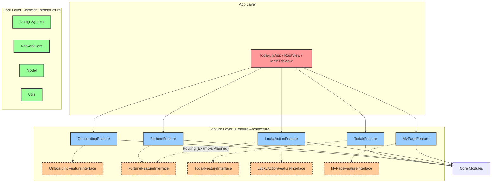
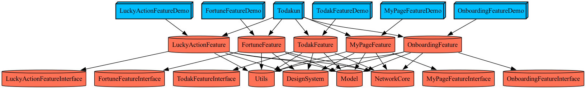

# 토닥운 (todakun)

오늘의 운을 기반으로 사용자의 하루 선택과 행동을 설계하는 데일리 체크인형 자기관리 앱.

## 🛠️ Tech Stack & Architecture
- **Language**: Swift 6.0+
- **Platform**: iOS 17.0+
- **UI Framework**: SwiftUI
- **Architecture**: TCA (The Composable Architecture)
- **Project Generator**: Tuist (Static Frameworks)

## 📁 Project Structure
본 프로젝트는 **App - Feature - Core** 3계층 구조로 이루어진 멀티 모듈 아키텍처로 설계되었습니다. (아래 서술된 내용은 프로젝트가 지향하는 최종 아키텍처 모델이며, 현재는 구조적인 뼈대(Skeleton/Stub) 위주로 구성되어 개발 진행 중입니다.)

특히 **Feature 레이어**는 피처 간 참조 사이클을 방지하고 빌드 최적화를 달성하기 위해 **uFeature 아키텍처(Interface/Testing 분리)**를 채택했습니다.
- 각 피처는 `Interface` 타겟, 구체적인 본체 `Implementation` 타겟, 그리고 공유 가능한 테스트 더블을 제공하는 `Testing` 타겟으로 분리됩니다.
  - **`Interface`**: 피처의 외부 노출 API 계약(프로토콜 등)만 정의하여 컴파일 의존성을 최소화합니다.
  - **`Implementation`**: 피처의 핵심 UI 뷰와 비즈니스 로직(TCA Reducer 등)을 구현합니다.
  - **`Testing`**: 피처의 Mock/Stub 등 테스트 더블을 구현하며, 타 피처의 단위 테스트나 예제 앱 등에서 의존성 주입 시 Mock 객체로 활용됩니다.
- 피처의 본체(Implementation)끼리는 절대 서로 참조하지 않으며, 타 피처로의 화면 전환(네비게이션)이 필요할 때는 상대 피처의 **Interface** 타겟만을 의존합니다. (현재는 실제 화면 흐름 바인딩이 구현되지 않은 스텁 상태입니다.)
- `MainTab`이나 `Root`와 같이 전체 피처들을 조립하는 껍데기 화면 코드는 피처 레이어가 아닌 최상위 **`App` 레이어** 내부에 작성되어 최종 런타임 조립(Composition Root)을 담당합니다. (현재 `RootApp`은 임시 SwiftUI View로 구성되어 있으며, 실제 앱 조립은 스텁 상태입니다.)



- **Projects/App**: 진입점 타겟 및 전체 기능 조립 (RootView, MainTabView 포함)
- **Projects/Feature**: 서로 완벽히 격리된 독립적인 비즈니스 로직 및 화면 단위
  - `OnboardingFeature`: 최초 설정 (닉네임, 생년월일, 성별, 관심 주제 선택)
  - `FortuneFeature`: 운세 리포트, 행운 액션 (운세 탭)
  - `TodakFeature`: 고민 결정 도우미 (토닥이 탭)
  - `LuckyActionFeature`: 오늘의 행동 추천 및 실행 (행운 액션 탭)
  - `MyPageFeature`: 설정 및 프로필 (마이 탭)
- **Projects/Core**: 앱 전반에 걸쳐 사용되는 공통 모듈
  - `DesignSystem`: 컬러, 폰트, 공통 UI 컴포넌트 및 에셋
  - `NetworkCore`: 네트워크 API 클라이언트
  - `Model`: 공통 데이터 객체
  - `Utils`: 각종 헬퍼 및 확장 파일

---

## 🚀 Getting Started

### 1. Requirements
본 프로젝트는 **Mise**를 통해 Tuist와 SwiftLint 버전을 관리합니다. 로컬 컴퓨터에 `mise`가 설치되어 있어야 합니다.
```bash
# mise 설치 (미설치 상태인 경우)
brew install mise

# 설정된 도구들(Tuist, SwiftLint 등) 한번에 설치
mise install
```

### 2. Setup & Run
프로젝트 레포지토리를 클론한 후, **최초 1회** Git Hooks를 설정하여 아키텍처 검증 및 Git 컨벤션 룰을 활성화해야 합니다.

```bash
# Git Hooks 설정 (필수)
./scripts/setup-hooks.sh
```

설정 스크립트는 현재 Mise 실행 경로를 저장소의 로컬 Git 설정에 기록합니다. Mise 설치 경로가 변경된 경우 스크립트를 다시 실행해주세요.

의존성 패키지를 가져온 뒤, Xcode 프로젝트(.xcworkspace)를 생성하여 실행합니다.

*(※ `mise`가 셸에 활성화(`mise activate`)되어 있다면 `mise exec --` 접두사 없이 바로 `tuist` 명령어를 사용할 수 있습니다.)*

```bash
# 의존성 패키지 Fetch (TCA 등)
tuist install

# Xcode Workspace 생성 및 실행
tuist generate
```

### 3. Dependency Graph
프로젝트의 아키텍처 및 모듈 의존성 그래프를 시각화하여 확인하려면 아래 명령어를 사용합니다.
```bash
# 테스트 타겟 및 외부 의존성을 제외하고 코어/피처 아키텍처 및 Example 앱 타겟을 시각화 (png 형식으로 docs/graph.png 저장)
tuist graph --skip-test-targets --skip-external-dependencies --format png --no-open -o docs
```
*(실제 추출된 아키텍처 구조도)*
<br>


### 4. Code Convention Validation
SwiftLint를 사용해 프로젝트의 Swift 코드 컨벤션을 검사합니다. 검사 대상과 제외 경로, 활성화 규칙은 루트의 `.swiftlint.yml`에서 관리합니다.

```bash
# 코드 컨벤션 검사
./scripts/lint.sh

# 자동 수정 가능한 위반 사항 수정
mise exec -- swiftlint lint --fix --config .swiftlint.yml
```

초기 도입 단계에서는 SwiftLint 기본 규칙을 사용하되, 구조 변경에 대한 팀 합의가 필요한 일부 규칙은 비활성화되어 있습니다. 새 규칙은 팀 합의 후 점진적으로 활성화합니다.

Git Hooks가 설정되어 있으면 push 전에 SwiftLint와 아키텍처 검증이 순서대로 실행됩니다.

### 5. Architecture Validation
App / Feature / Core 계층 규칙과 물리 의존성 위반 여부를 빠르게 확인하려면 아래 명령어를 실행합니다. (스크립트 내부에서 자동으로 `tuist graph`를 실행하여 최신 상태의 `docs/graph.dot`를 검증합니다.)
```bash
./scripts/sync-and-validate.sh
```
